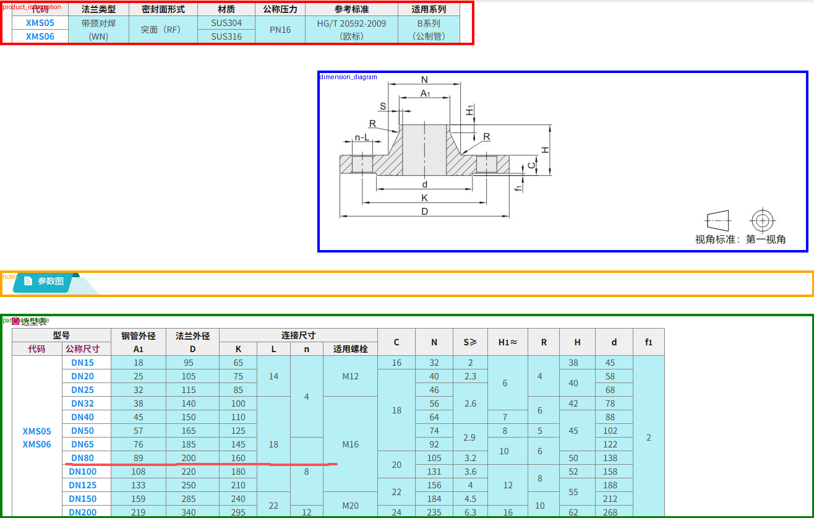

# Phase 4A Acceptance

Date: 2026-07-22

## Scope

Implemented 2D drawing image validation, normalization, layout detection provider adapters, region merging, coordinate conversion, Pillow cropping, crop persistence, crop package reconstruction, and manual region replacement API.

Not implemented in this phase:

- Product information semantic extraction
- Parameter table value extraction
- Target DN row selection
- STEP dimension comparison
- LLM calls
- YAML generation
- Component Profile

## Provider

- Configured `DRAWING_LAYOUT_PROVIDER=auto`.
- `MINERU_LAYOUT_MODE=disabled` in the current environment.
- Auto mode fell back to `VisionLayoutProvider`.
- Vision provider only produced layout regions; it did not extract parameter values or product semantics.

## XMS06 Drawing Acceptance Run

Input image: `D:\3D解析\测试.png`

Original image:

- Width: `1316`
- Height: `837`
- SHA256: `73337bccb6513e24540ead6c4424d7712f3b0cb101e5f189729d994f3c4c4d7a`

Inference image:

- Width: `1316`
- Height: `837`
- SHA256: `c78661c54cd0c403657171040a95eac4ef4b956c378ada87fd567cccdab38f71`

Layout status:

- `layout_ready`

PostgreSQL acceptance run:

```json
{
  "task_id": "74f945b0-5801-4c04-8acb-7215c4bdeab8",
  "revision_id": "7332d95f-eb0f-4be3-9454-5afde66dc9b0",
  "status": {
    "task_id": "74f945b0-5801-4c04-8acb-7215c4bdeab8",
    "status": "layout_ready"
  },
  "active_region_count": 4,
  "region_types": [
    "product_information",
    "dimension_diagram",
    "notes",
    "parameter_table"
  ],
  "forbidden_present": [],
  "api_region_count": 4
}
```

## Regions

### product_information

- Provider: `vision`
- Confidence: `0.72`
- `bbox_normalized`: `[0.014437689969604863, 0.0035842293906810036, 0.5653495440729484, 0.08363201911589008]`
- `bbox_pixels`: `[19, 3, 744, 70]`
- `padded_bbox_pixels`: `[0, 1, 766, 72]`
- Crop SHA256: `9062f175a6640b355a5ba7e97289775c4b00bf89b6aedd388dc23088ab646174`
- Crop size: `766 x 71`
- Visual check: contains the top product information table, including `XMS06`, `SUS316`, `PN16`, and `HG/T 20592-2009`.

### dimension_diagram

- Provider: `vision`
- Confidence: `0.72`
- `bbox_normalized`: `[0.41717325227963525, 0.15173237753882915, 0.9650455927051672, 0.47072879330943845]`
- `bbox_pixels`: `[549, 127, 1270, 394]`
- `padded_bbox_pixels`: `[513, 114, 1306, 407]`
- Crop SHA256: `9efdce0528eae440ccd165d9c644e7c29976fd2290f4aa8a70a156e4a1afb353`
- Crop size: `793 x 293`
- Visual check: keeps the main dimension diagram, dimension arrows, symbols, and first-angle projection marker.

### notes

- Provider: `vision`
- Confidence: `0.72`
- `bbox_normalized`: `[0.015197568389057751, 0.5232974910394266, 1.0, 0.5710872162485066]`
- `bbox_pixels`: `[20, 438, 1316, 478]`
- `padded_bbox_pixels`: `[0, 437, 1316, 479]`
- Crop SHA256: `592664371c0c37e4f13443d7f9febe15f5c3d44c09bb930766e47542abc0ea41`
- Crop size: `1316 x 42`

### parameter_table

- Provider: `vision`
- Confidence: `0.72`
- `bbox_normalized`: `[0.0, 0.6129032258064516, 1.0, 0.998805256869773]`
- `bbox_pixels`: `[0, 513, 1316, 836]`
- `padded_bbox_pixels`: `[0, 507, 1316, 837]`
- Crop SHA256: `943a8ce3f13eeac8ab443ce5c925b59260e1f7216cd166a4a3a046378d9d6851`
- Crop size: `1316 x 330`
- Visual check: preserves the full parameter table context, including multi-level headers, XMS05/XMS06 rows, DN80 row, and D/K/L/n/C/N/H/d/f1 columns.

## Acceptance Preview

Preview image with region boxes:



Generated file:

- `docs/acceptance/phase-4A-preview.png`

## Automated Test Output

Command:

```powershell
cd backend
conda run -n 3dcad pytest -q tests/test_drawing_phase4a.py
```

Output:

```text
19 passed, 1 warning in 1.87s
```

Full regression command:

```powershell
cd backend
conda run -n 3dcad pytest -q
```

Output:

```text
66 passed, 1 warning in 12.66s
```

## Known Limitations

- MinerU was not configured in this environment, so the acceptance image used the fallback Vision layout provider.
- The fallback Vision provider is a deterministic layout heuristic for 4A region detection only. It does not read or store table values or product semantics.
- The backend suite still emits the existing FastAPI/Starlette TestClient warning.
